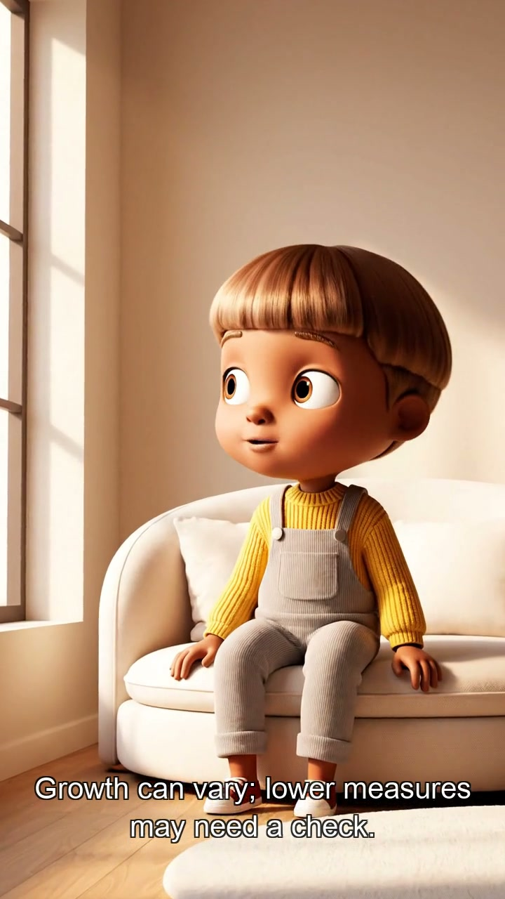
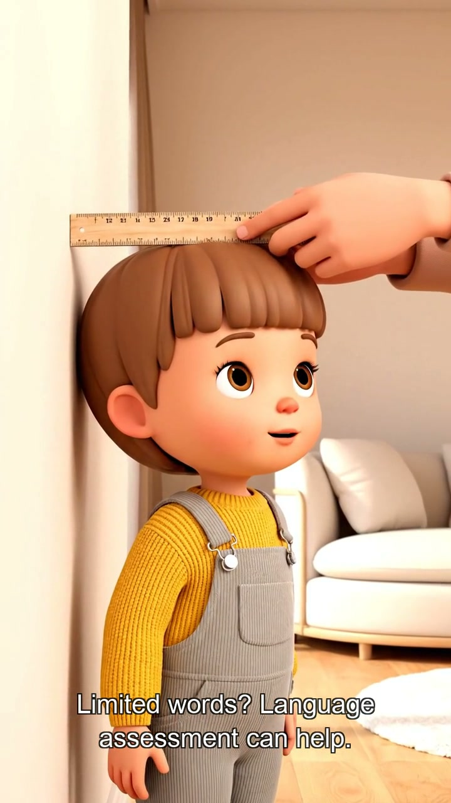

# MoDoc AI Video Pipeline


MoDoc is a pediatric health platform that answers parents' questions — things like "my 3-year-old isn't talking much, is that normal?" or "should antibiotics help with a cough?" The problem was turning those Q&A posts into short-form videos for YouTube Shorts, Instagram Reels, and Facebook. Every video needed to be in Korean, English, and Spanish. Doing that by hand — writing three scripts, generating visuals, recording narration, editing, exporting — took hours per video.

This pipeline automates the whole thing. You point it at a row in the Q&A spreadsheet, and it outputs three ready-to-upload MP4 files. Script generation, video generation, voiceover, and subtitle rendering all happen without manual intervention.

## Video Preview

> Row 7 — "Is my 3-year-old's growth and language development on track?"

<p align="center">
  
  &nbsp;
  
  &nbsp;
  
  &nbsp;
  
</p>

<p align="center"><em>English (Scene 1 · 2) &nbsp;·&nbsp; Korean (Scene 1 · 2) &nbsp;·&nbsp; Same Veo clips, localized narration and subtitles per language</em></p>

All three language versions share the same Veo-generated video clips. Only the voiceover and subtitles differ — which also means the visual quality is identical across languages.

## How It Works

One command runs the full pipeline:

```bash
python3 -m modoc_pipeline run-all --row 7
```

Internally that does five stages in sequence:

```text
generate → plan-video → veo → tts → render
```

| Stage | What Happens |
|-------|-------------|
| `generate` | Reads the Q&A row from Excel, uses Gemini Search grounding, writes parent-friendly scripts in English, Korean, and Spanish, and extracts medical claims for reviewer sign-off |
| `plan-video` | Calls Gemini again to create scene contracts: narration source, muted-viewer visual goal, must-show objects, gentle meme beat, and concise Veo prompts |
| `veo` | Generates run-level Gemini reference images, calls Veo 3.1, uses reference/last-frame continuation, and runs Gemini visual QA on sampled frames with scene-level retries |
| `tts` | Calls Gemini TTS to narrate each scene individually — Korean with Kore voice, English with Puck, Spanish with Leda. Per-scene audio means no tempo compression |
| `render` | Calls FFmpeg to extend each Veo clip to match its narration duration, concatenate clips, overlay captions timed to actual audio, and export the final MP4 |

## What's Automated

- Reading Q&A content from `Q&A Blog Contents List.xlsx`
- Generating medically-cautious scripts in English, Korean, and Spanish
- Extracting medical claims with source evidence for reviewer packets
- Writing a Markdown review packet per run
- Planning 4-scene Veo prompts with a controlled mouthless MoDoc Guide and concrete infographic props
- Generating Veo 3.1 clips with frame continuation for cross-clip visual consistency
- Running Gemini visual QA against sampled Veo frames and regenerating failed scenes automatically
- Per-scene TTS narration with language-specific voices (Kore, Puck, Leda)
- Extending Veo clips to match narration duration (no speed compression)
- Overlaying captions timed to actual audio per scene
- Rendering final 9:16 MP4 files for YouTube Shorts / Instagram Reels

## What's Still Manual

- Medical review — a clinician still needs to sign off before publishing
- Publishing to YouTube, Instagram, and Facebook
- Final publishing decision after reviewing the MP4 and review packet
- View count collection for KPI tracking

## Tech Stack

| Layer | Technology | Why |
|-------|-----------|-----|
| Script generation | Gemini 3.5 Flash Lite + Google Search grounding | Medical accuracy, multilingual quality, structured output, source grounding |
| Visual references | Gemini image generation | Run-level character/style anchor before Veo |
| Video generation | Veo 3.1 (`veo-3.1-generate-preview`) | Best available 9:16 animated video quality |
| Frame continuity | Veo image-to-video (reference/last frame → next clip) | Reduces character and style drift across independently generated clips |
| TTS narration | Gemini TTS (`gemini-3.1-flash-tts-preview`) | Per-scene generation eliminates audio compression artifacts |
| Language voices | Kore (Korean) · Puck (English) · Leda (Spanish) | Natural pronunciation per language |
| Video assembly | FFmpeg | clip extension (tpad), caption overlay (RGBA), audio concat |
| Source data | Excel via openpyxl | Reads existing Q&A spreadsheet as-is |

## Pipeline Architecture

```
Q&A Blog Contents List.xlsx
         │
         ▼
  [generate] ──────────────────────────────────────────────────────────────
  Gemini 3.5 Flash Lite + Google Search                                     │
  ├── scripts.json          (English / Korean / Spanish)                   │
  ├── claims.json           (medical claims + evidence)                    │
  └── review_packet.md      (clinician review aid)                         │
         │                                                                  │
         ▼                                                                  │
  [plan-video]                                                              │
  Gemini 3.5 Flash Lite                                                     │
  ├── character_bible       (mouthless MoDoc Guide + palette + background)  │
  ├── scene_contracts       (must-show/must-not-show + visual goal)         │
  ├── visual_scenes.json    (4 Veo prompts, shared across languages)        │
  └── localized_tracks.json (captions + TTS text per scene per language)   │
         │                                                                  │
         ▼                                                                  │
  [veo]                                                                     │
  Gemini image + Veo 3.1 + Gemini visual QA                                 │
  ├── references/character_reference.png                                    │
  ├── scene_01.mp4  ← reference image when available                       │
  ├── scene_02.mp4  ← scene_01 last frame as first frame                  │
  ├── scene_03.mp4  ← scene_02 last frame as first frame                  │
  └── scene_04.mp4  ← scene_03 last frame as first frame                  │
         │                                                                  │
         ▼                                                                  │
  [tts]                                                                     │
  Gemini TTS (per scene × per language = 12 audio files)                   │
  ├── audio/korean/scene_01.wav  audio/english/scene_01.wav  audio/spanish/scene_01.wav
  └── ...                                                                   │
         │                                                                  │
         ▼                                                                  │
  [render] ─────────────────────────────────────────────────────────────────
  FFmpeg                                                                    │
  ├── Extend each clip to match its TTS audio duration (freeze last frame) │
  ├── Concatenate extended clips + concatenated audio                      │
  ├── Overlay captions timed to actual audio durations (not fixed seconds) │
  └── Export 3 × 9:16 MP4                                                  │
         │
         ▼
  videos/Row_7/
  ├── Row_7_english.mp4
  ├── Row_7_korean.mp4
  └── Row_7_spanish.mp4
```

## Setup

```bash
# 1. Clone and install
git clone <repo-url> && cd Modoc-Ai-Pipeline
python3 -m venv .venv && source .venv/bin/activate
pip install -e .

# 2. Set up API key
cp .env.example .env
# Add your Gemini API key to .env:
# GEMINI_API_KEY=your_key_here

# 3. Install FFmpeg (required for rendering)
brew install ffmpeg
```

`.env` reference:

```env
GEMINI_API_KEY=your_key_here
GEMINI_MODEL=gemini-3.5-flash-lite
GEMINI_JUDGE_MODEL=gemini-3.5-flash-lite
GEMINI_ENABLE_SEARCH=true
GEMINI_VEO_MODEL=veo-3.1-generate-preview
GEMINI_VEO_PERSON_GENERATION=allow_all
GEMINI_VEO_GENERATE_AUDIO=false

GEMINI_TTS_MODEL=gemini-3.1-flash-tts-preview
GEMINI_TTS_VOICE=Kore
GEMINI_IMAGE_MODEL=gemini-3.1-flash-image
VISUAL_STYLE=character-infographic
VISUAL_QA=true
MAX_VISUAL_RETRIES=2
BGM_MODE=off
```

## Commands

### One-command generation

```bash
# Full pipeline for a specific row
python3 -m modoc_pipeline run-all --row 7

# Smoke test — English only, 1 clip (fast, cheap)
python3 -m modoc_pipeline run-all --row 7 --languages english --max-clips 1
```

### Step-by-step (useful for debugging or re-running one stage)

```bash
# 1. Generate scripts + review packet
python3 -m modoc_pipeline generate --row 7

# 2. Plan video scenes
python3 -m modoc_pipeline plan-video --run logs/<run_id>

# 3. Generate Veo clips (takes ~15–20 min for 4 scenes)
python3 -m modoc_pipeline veo --run logs/<run_id>

# 4. Generate per-scene TTS narration
python3 -m modoc_pipeline tts --run logs/<run_id>

# 5. Render final MP4 files
python3 -m modoc_pipeline render --run logs/<run_id>
```

Re-generating specific clips only (e.g. after a hallucination in scene 3):

```bash
python3 -m modoc_pipeline veo --run logs/<run_id> --scene-ids scene_03,scene_04
```

The pipeline will automatically pick up `scene_02_last_frame.jpg` as the starting frame for scene_03, maintaining continuity.

## Output Files

**Per-run artifacts** in `logs/<run_id>/`:

```
scripts.json              — English / Korean / Spanish scripts
claims.json               — Medical claims with evidence references
review_packet.md          — Reviewer-ready Markdown document
visual_scenes.json        — 4 Veo scene prompts with character + environment bibles
visual_qa/                — Gemini frame QA reports per scene
references/               — Gemini-generated character/style reference images
localized_tracks.json     — Captions and TTS text per scene per language
audio/{language}/         — Per-scene WAV files (scene_01.wav, scene_02.wav, …)
veo/shared/               — Shared Veo clips + last-frame JPEGs for continuity
render_assets/            — Extended clips, caption PNGs, SRT files, concat lists
video_status.json         — Current pipeline stage and status
```

**Final videos** in `videos/Row_<n>/`:

```
Row_7_english.mp4
Row_7_korean.mp4
Row_7_spanish.mp4
```

## What's Coming Next

A few things that would meaningfully improve this pipeline, roughly in priority order:

**Visual consistency** — Veo still drifts occasionally even with frame continuation and the character bible. The plan is to pass scene_01's first frame as a reference image to all subsequent clips (Veo 3.1 supports up to 3 reference images). That should eliminate most remaining character drift.

**Medical review integration** — Right now the clinician gets a Markdown packet and signs off manually. The next step is a simple approval status field that blocks the `render` stage until the review passes, so nothing goes to upload without sign-off.

**Thumbnail generation** — Each video needs a thumbnail for YouTube. The current plan is to use Gemini Imagen to generate a thumbnail that matches the video's character and topic, using the character bible as the prompt.

**Platform publishing** — Upload helpers for YouTube Shorts, Instagram Reels, and Facebook with the right metadata (title, description, tags) pre-filled from the generated scripts.

**Batch processing** — Running all rows in the spreadsheet in one go, with a status dashboard that shows what's been generated, what's pending review, and what's been published.

**A/B visual style testing** — Generate two versions of each video with different visual styles and track which performs better by view count.
